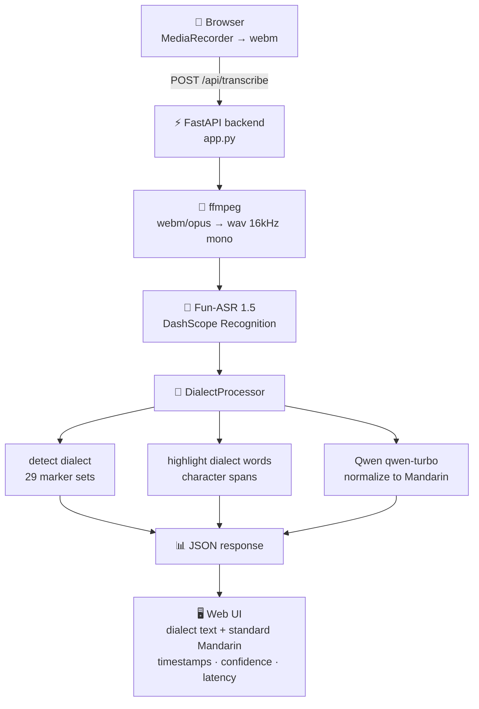

<div align="center">

# Dialect Speech Recognition v2.0

**Turn spoken Chinese dialects into standard Mandarin text — powered by Fun-ASR 1.5 + Qwen, served by FastAPI**

[](https://www.python.org/)
[](https://fastapi.tiangolo.com/)
[](LICENSE)
[](https://github.com/JingHao-Leon/dialect-asr-v2/commits/main)
[](https://github.com/JingHao-Leon/dialect-asr-v2)

</div>

---

A web app that records or uploads dialect speech, transcribes it with **Alibaba Bailian Fun-ASR 1.5** (MoE architecture, 30 languages + Chinese dialects), then post-processes the result: dialect detection via a **29-entry marker dictionary**, dialect-word highlighting, and an optional **Qwen LLM pass that normalizes dialect text into standard written Mandarin** — shown side by side in the browser.

## ✨ Highlights

<table>
<tr>
<td width="50%">

### 🚀 Fun-ASR 1.5 Engine
Alibaba Tongyi Lab's latest ASR model via DashScope SDK — per vendor specs: CER down 56.2% vs the previous generation, 5 dialects above 90% accuracy, 15 above 80%, with smart text normalization (punctuation, numbers, dates) built in.

</td>
<td width="50%">

### 🎯 41 Language / Dialect Hints
Auto-detection out of the box, or explicitly hint the expected dialect — 6 major dialect families (Cantonese, Wu, Min, Hakka, Xiang, Gan), 15 Mandarin sub-dialects, 8 regional sub-dialects, and 8 world languages.

</td>
</tr>
<tr>
<td width="50%">

### 🪄 Dialect → Standard Mandarin
An optional Qwen (`qwen-turbo`) pass rewrites dialect colloquialisms into standard written Mandarin, so you see **raw dialect text and normalized Mandarin side by side**. Skipped automatically when no API key is set.

</td>
<td width="50%">

### 🔍 Dialect Word Highlighting
A curated marker dictionary covering 29 dialects detects the dialect from the transcript and returns exact character spans of dialect-specific words (e.g. 侬, 阿拉, 今朝 for Shanghainese) for in-UI highlighting.

</td>
</tr>
<tr>
<td width="50%">

### 🎤 Browser-Native Recording
No plugins: `MediaRecorder` captures webm audio, `AudioContext` + `AnalyserNode` renders a live waveform, and everything ships as one FastAPI app serving the UI, the API, and auto-generated OpenAPI docs.

</td>
<td width="50%">

### ⚡ One-Click Launch
`run.sh` / `run.ps1` / `run.bat` load your API key, install dependencies, check ffmpeg, and boot the server on port 5001 — works on macOS, Linux, and Windows.

</td>
</tr>
</table>

## 🔄 How It Works



## 🚀 Quick Start

**Prerequisites:** Python 3, ffmpeg (`brew install ffmpeg` on macOS, `sudo apt install ffmpeg` on Ubuntu), and a [DashScope API key](https://bailian.console.aliyun.com/).

```bash
git clone https://github.com/JingHao-Leon/dialect-asr-v2.git
cd dialect-asr-v2

pip install fastapi uvicorn python-multipart dashscope

# configure your key (see Configuration below)
export DASHSCOPE_API_KEY=sk-xxx

./run.sh        # Windows: double-click run.bat, or run run.ps1
```

Then open **http://127.0.0.1:5001** in your browser.

- 📖 **Interactive API docs** (auto-generated): http://127.0.0.1:5001/docs
- ❤️ **Health check**: http://127.0.0.1:5001/api/health

## 🔑 Configuration

The API key is resolved at startup in this priority order (`app.py`):

1. **Environment variable** (highest priority, CI/CD friendly)
   ```bash
   export DASHSCOPE_API_KEY=sk-xxx
   ```
2. **Project-level** `config/dialect_stt.env` — copy `config/dialect_stt.env.template` and fill it in
3. **User-level** `~/.config/dialect_stt.env`

| Variable | Purpose |
|---|---|
| `DASHSCOPE_API_KEY` | Required — Fun-ASR transcription (also used for Qwen normalization) |
| `QWEN_API_KEY` | Optional fallback key for the dialect→Mandarin LLM pass |
| `PORT` | Optional server port, defaults to `5001` |

> ⚠️ Never commit a real key — `config/dialect_stt.env` is gitignored. If a key leaks (chat logs, git push, email), **revoke and regenerate it immediately** in the Bailian console.

## 🛠️ API

### `POST /api/transcribe`

| Parameter | Type | Required | Description |
|---|---|---|---|
| `file` | file | ✅ | Audio file — wav / mp3 / m4a / webm / ogg / flac / opus / mp4 (max 25 MB) |
| `dialect` | str | ❌ | Hint: `auto` (default), `普通话`, `粤语`, `上海话`, `四川话`, `闽南语`, … 41 options |

**Response:**

```json
{
  "ok": true,
  "engine": "fun-asr-realtime-1.5",
  "model_name": "fun-asr-realtime",
  "raw_text": "侬好，今朝天气真好啊",
  "standard_text": "你好，今天天气真好",
  "detected_dialect": "上海话",
  "used_dialect": "上海话",
  "highlights": [{"word": "侬", "start": 0, "end": 1}],
  "confidence": 0.96,
  "stt_latency_ms": 997,
  "total_latency_ms": 1050,
  "sentences": [{"text": "侬好，今朝天气真好啊", "begin_time": 0, "end_time": 2400}],
  "llm_normalize": {"applied": true, "dialect": "上海话", "model": "qwen-turbo"}
}
```

### `GET /api/health`

Service status: engine availability, ffmpeg presence, upload size limit, and the full list of supported dialects.

### Dialect / language coverage

- **General** (5): `auto` · 普通话 · 英语 · 日语 · 韩语
- **Dialect families** (6): 粤语 · 吴语 · 闽语 · 客家话 · 湘语 · 赣语
- **Mandarin sub-dialects** (15): 东北话 · 北京话 · 天津话 · 山东话 · 河南话 · 陕西话 · 甘肃话 · 宁夏话 · 山西话 · 四川话 · 云南话 · 贵州话 · 湖北话 · 湖南话 · 江西话
- **Wu sub-dialects** (4): 上海话 · 苏州话 · 杭州话 · 宁波话
- **Min sub-dialects** (4): 闽南语 · 潮汕话 · 闽东话 · 闽北话
- **World languages** (8): 俄语 · 法语 · 西班牙语 · 阿拉伯语 · 泰语 · 越南语 · 印尼语 · 马来语

## 📁 Project Structure

```
dialect-asr-v2/
├── app.py                  # FastAPI app: routes, key loading, pipeline wiring
├── stt_engine.py           # Fun-ASR 1.5 wrapper (DashScope Recognition)
├── dialect_processor.py    # Dialect detection, highlighting, Qwen normalization
├── audio_utils.py          # ffmpeg audio conversion (webm/opus → wav 16kHz)
├── config/
│   └── dialect_stt.env.template  # API key template (real .env is gitignored)
├── templates/index.html    # Web UI (dialect picker + recorder)
├── static/                 # Frontend assets (app.js, style.css)
├── docs/ARCHITECTURE.md    # Architecture deep-dive (Chinese)
├── 实践报告.md              # Course design report, ~8k words (Chinese)
├── START.md / INNOVATE.md  # 5-step setup guide / innovation notes (Chinese)
├── run.sh / run.ps1 / run.bat  # One-click launchers (mac/Linux/Windows)
└── LICENSE                 # MIT
```

## ⚠️ Limitations & Notes

- **Cloud-dependent** — transcription and normalization call Alibaba Bailian APIs; there is no offline mode. Rough cost reference: Fun-ASR ~¥0.0001/s, Qwen-turbo ~¥0.003/1k tokens (free monthly quotas apply).
- **Dialect detection is heuristic** — `detect_dialect` matches marker words from a dictionary; it's meant for UI hints, not as a linguistic classifier.
- **Mandarin normalization is optional** — without a key, or for `普通话`/`auto`, the raw transcript is returned unchanged.
- **CORS is wide open** (`allow_origins=["*"]`) for local/dev convenience — tighten it before any public deployment.

---

<div align="center">
<sub>
Built with <a href="https://help.aliyun.com/zh/model-studio/developer-reference/funasr-api">Fun-ASR 1.5</a> · Qwen · FastAPI · ffmpeg — MIT License © 2026 JingHao-Leon<br>
Dialect names kept in Chinese on purpose: that's the language they belong to. 🀄
</sub>
</div>
